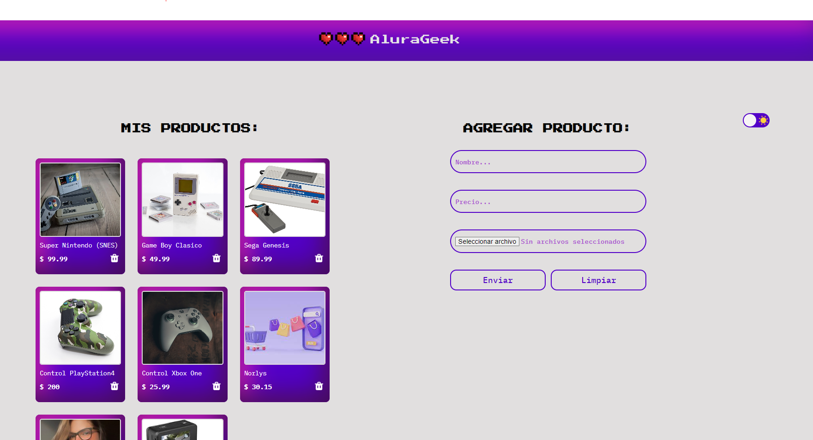

# 🌟 Alura Geek

**Alura Geek** es una aplicación de tienda en línea construida como parte de los desafíos de **Alura Latam**. El proyecto está desarrollado utilizando **HTML**, **CSS**, y **JavaScript** para el frontend, y emplea **JSON Server** como simulador de base de datos para gestionar solicitudes **GET**, **POST**, y **DELETE**.

---
## Su sitio está activo en `https://norlysc.github.io/aluraGeek/`

## 📋 Características

- **Ver Productos**: Los usuarios pueden ver una lista de productos disponibles en la tienda.
- **Agregar Producto**: Los administradores pueden añadir nuevos productos a través de un formulario.
- **Eliminar Producto**: Los administradores pueden eliminar productos de la tienda.
- **Diseño Responsivo**: La interfaz se adapta a diferentes tamaños de pantalla.
- **Tema Noche**: El usuario puede cambiar el tema para un descanso visual.

---
## Figma
- https://www.figma.com/design/eSIemWMmHT750XP4D810yz/AluraGeek---new?node-id=14-123&node-type=frame&t=qVbVQiwKUFhtUzla-0

## 🛠️ Tecnologías Utilizadas

- **HTML5** - Estructura de la aplicación.
- **CSS3** - Estilos y diseño responsivo.
- **JavaScript (ES6+)** - Lógica de la aplicación.
- **JSON Server** - Simulador de una base de datos para pruebas de API.

---

## 🚀 Instalación

Para ejecutar este proyecto en tu máquina local, sigue los siguientes pasos:

1. **Clona el repositorio:**

    ```bash
    git clone https://github.com/Norlysc/aluraGeek.git
    ```

2. **Navega al directorio del proyecto:**

    ```bash
    cd alura-geek
    ```

3. **Instala JSON Server (si aún no lo tienes):**

    ```bash
    npm install -g json-server
    ```

4. **Inicia JSON Server:**

    ```bash
    json-server --watch db.json --port 3001
    ```

5. **Visualiza la Aplicación:**
   - Abre el archivo `index.html` en tu navegador o usa la extensión **Live Server** en tu editor para ejecutarlo.

---

## 🎮 Uso de la Aplicación

- **Visualizar Productos**: Al cargar la aplicación, puedes ver todos los productos listados desde la base de datos de JSON Server.
- **Añadir Productos**: Usa el formulario en la sección de administración para agregar nuevos productos.
- **Eliminar Productos**: Haz clic en el botón de eliminar para quitar un producto de la lista.

---

## ✨ Autor

- **Norlys Castañeda** 

---

¡Gracias por visitar este proyecto! 💻🚀
